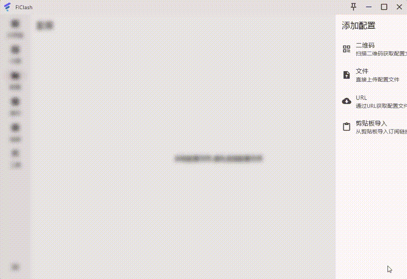

## FlClash Enhanced

<div align="center">
  
**语言选择 | Language Selection**

[🇨🇳 中文](README.md) | [🇺🇸 English](README-EN.md)

</div>

[](https://github.com/chen08209/FlClash)
[](LICENSE)
[](FEATURES_AND_ENHANCEMENTS.md)

基于 [FlClash](https://github.com/chen08209/FlClash) 的增强版本，添加了智能剪切板监听、多协议链接解析、智能自动测速等全新功能。

## 🎥 功能演示



*视频展示了增强版的部分核心功能：智能剪切板监听、多协议链接解析等新特性*

## 🆕 增强功能

### 核心新功能
- 🔄 **智能剪切板监听** - 自动检测并导入代理链接
- 🔗 **多协议链接解析** - 支持 ss://、vless://、vmess://、ssr://、trojan://
- ⚡ **智能自动测速** - 仅测试用户节点，自动切换最快节点
- 📋 **多链接批量导入** - 支持多种分隔符格式的批量导入
- ⚙️ **优化测试URL设置** - 主题适配的智能界面
- 📊 **完整导入历史** - 记录所有剪切板导入操作

### 平台支持
| 平台 | 多协议解析 | 剪切板监听 | 批量导入 | 智能测速 | 预构建版本 |
|------|-----------|-----------|---------|----------|------------|
| Windows | ✅ | ✅ | ✅ | ✅ | ✅ 已提供 |
| Android | ✅ | ✅ | ✅ | ✅ | ✅ 已提供 |
| macOS | ✅ | ✅ | ✅ | ✅ | ⚠️ 需自建 |
| Linux | ✅ | ✅ | ✅ | ✅ | ⚠️ 需自建 |

## 📦 下载和使用

### 预构建版本 ✅
增强版本已提供多平台预构建版本：
- 📁 **统一下载位置**：[GitHub Releases](https://github.com/sadhjkawh/FlClash-Enhanced/releases)

#### Windows x64
- 🚀 直接运行：`FlClash.exe`
- 📦 支持格式：便携版

#### Android
- 📱 支持架构：arm64-v8a / armeabi-v7a / x86_64
- 📦 格式：APK 安装包
- ⚠️ 需要允许安装未知来源应用

### 其他平台用户 🔧
macOS、Linux 用户需要自行构建，详见 [构建指南](FEATURES_AND_ENHANCEMENTS.md#构建要求)

## ⚠️ 重要提示

**此为开发版本**，尚未进行大量测试，可能存在未知Bug。
- 🧑‍💻 **推荐用户**：开发者或熟练用户
- 💾 **数据安全**：使用前请做好配置备份
- 📱 **Android 注意**：APK 为未签名版本，需要允许安装未知来源应用
- 🐛 **问题反馈**：欢迎在 [Issues](https://github.com/sadhjkawh/FlClash-Enhanced/issues) 中报告Bug


## 📖 详细文档

完整的功能介绍、使用方法和技术实现请查看：
- 📘 [**增强功能完整指南**](FEATURES_AND_ENHANCEMENTS.md)
- 👥 [贡献者信息](CONTRIBUTORS.md)
- ⚖️ [版权信息](COPYRIGHT)

## 🏗️ 快速构建

```bash
# 1. 克隆仓库
git clone https://github.com/sadhjkawh/FlClash-Enhanced.git
cd FlClash-Enhanced

# 2. 更新子模块
git submodule update --init --recursive

# 3. 安装依赖
flutter pub get

# 4. 构建（选择目标平台）
dart run setup.dart windows --arch amd64 --env stable  # Windows
dart run setup.dart android --arch arm64 --env stable  # Android
dart run setup.dart macos --arch arm64 --env stable    # macOS
dart run setup.dart linux --arch amd64 --env stable   # Linux
```

## 🙏 致谢

- **原作者**：[chen08209](https://github.com/chen08209) - 感谢创建了优秀的 [FlClash](https://github.com/chen08209/FlClash) 项目
- **增强开发**：[sadhjkawh](https://github.com/sadhjkawh) - 2025年增强功能开发

## 📄 许可证

本项目遵循 [GPL-3.0 License](LICENSE) 开源许可证。

---

<div align="center">

### 🌟 如果这个项目对您有帮助，请给个Star支持！

[⭐ 给个Star](https://github.com/sadhjkawh/FlClash-Enhanced/stargazers) | [📝 查看详细功能](FEATURES_AND_ENHANCEMENTS.md) | [🐛 报告问题](https://github.com/sadhjkawh/FlClash-Enhanced/issues)

</div>
